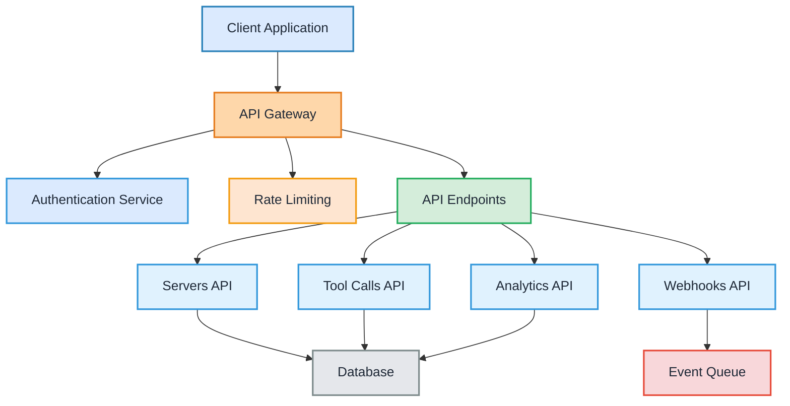

## Base URL

All API requests should be made to:

```
https://api.agentflare.com/v1
```

## API Architecture



## Authentication

The Agentflare API uses bearer token authentication. Include your API key in the Authorization header:

```bash
Authorization: Bearer <your-api-key>
```

<CodeGroup>

```bash cURL
curl -H "Authorization: Bearer <your-api-key>" \
  https://api.agentflare.com/v1/servers
```

```javascript JavaScript
const response = await fetch("https://api.agentflare.com/v1/servers", {
  headers: {
    Authorization: "Bearer <your-api-key>",
  },
});
```

```python Python
import requests

response = requests.get(
    'https://api.agentflare.com/v1/servers',
    headers={'Authorization': 'Bearer <your-api-key>'}
)
```

</CodeGroup>

## Rate Limiting

API requests are rate limited to ensure fair usage:

- **Free tier**: 60 requests per minute
- **Pro tier**: 600 requests per minute
- **Enterprise**: Custom limits

Rate limit information is included in response headers:

```
X-RateLimit-Limit: 60
X-RateLimit-Remaining: 59
X-RateLimit-Reset: 1640995200
```

## Response Format

All API responses follow a consistent JSON structure:

### Success Response

```json
{
  "success": true,
  "data": {
    // Response data
  },
  "meta": {
    "timestamp": "2024-01-01T00:00:00Z",
    "request_id": "req_123abc"
  }
}
```

### Error Response

```json
{
  "success": false,
  "error": {
    "code": "INVALID_REQUEST",
    "message": "Invalid request parameters",
    "details": {
      // Additional error details
    }
  },
  "meta": {
    "timestamp": "2024-01-01T00:00:00Z",
    "request_id": "req_123abc"
  }
}
```

## Status Codes

| Status Code | Description           |
| ----------- | --------------------- |
| 200         | Success               |
| 201         | Created               |
| 400         | Bad Request           |
| 401         | Unauthorized          |
| 403         | Forbidden             |
| 404         | Not Found             |
| 429         | Too Many Requests     |
| 500         | Internal Server Error |

## Pagination

List endpoints support pagination using `page` and `limit` parameters:

```
GET /v1/tool-calls?page=2&limit=50
```

Pagination metadata is included in the response:

```json
{
  "data": [...],
  "pagination": {
    "page": 2,
    "limit": 50,
    "total": 1234,
    "pages": 25
  }
}
```

## Webhooks

Configure webhooks to receive real-time notifications:

1. Go to Dashboard → Settings → Webhooks
2. Add your webhook endpoint URL
3. Select events to subscribe to
4. Save and verify the webhook

### Webhook Security

All webhooks include a signature header for verification:

```
X-Agentflare-Signature: sha256=...
```

<CodeGroup>

```javascript Verify Signature
const crypto = require("crypto");

function verifyWebhook(payload, signature, secret) {
  const hmac = crypto.createHmac("sha256", secret);
  const digest = "sha256=" + hmac.update(payload).digest("hex");
  return crypto.timingSafeEqual(Buffer.from(signature), Buffer.from(digest));
}
```

</CodeGroup>

## SDK Libraries

Official SDKs are available for popular languages:

<CardGroup cols={2}>
  <Card title="TypeScript/JavaScript" icon="js" href="/sdk/typescript">
    npm install @agentflare/telepathy-sdk
  </Card>
  <Card title="Python" icon="python" href="/sdk/python">
    pip install agentflare-telepathy
  </Card>
  <Card title="Go" icon="golang" href="/sdk/go">
    go get github.com/agentflare/telepathy-go
  </Card>
  <Card title="Ruby" icon="gem" href="/sdk/ruby">
    gem install agentflare-telepathy
  </Card>
</CardGroup>

## Next Steps

<CardGroup cols={2}>
  <Card title="Authentication" icon="key" href="/api-reference/authentication">
    Learn about API authentication
  </Card>
  <Card
    title="Servers API"
    icon="server"
    href="/api-reference/endpoints/servers"
  >
    Manage MCP servers
  </Card>
  <Card
    title="Tool Calls API"
    icon="terminal"
    href="/api-reference/endpoints/tool-calls"
  >
    Query tool call data
  </Card>
  <Card
    title="Analytics API"
    icon="chart-line"
    href="/api-reference/endpoints/analytics"
  >
    Access performance metrics
  </Card>
</CardGroup>
