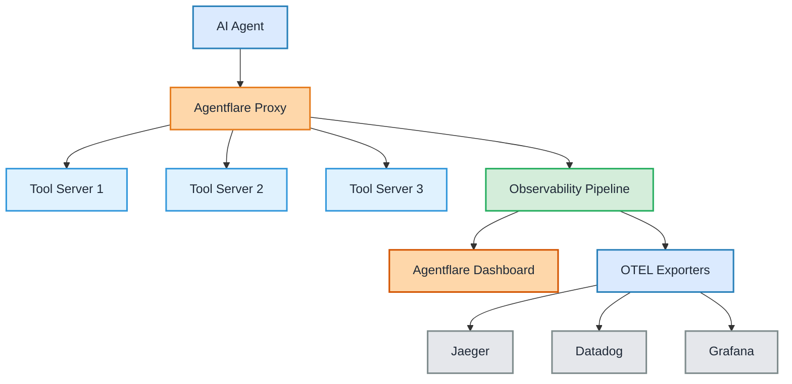
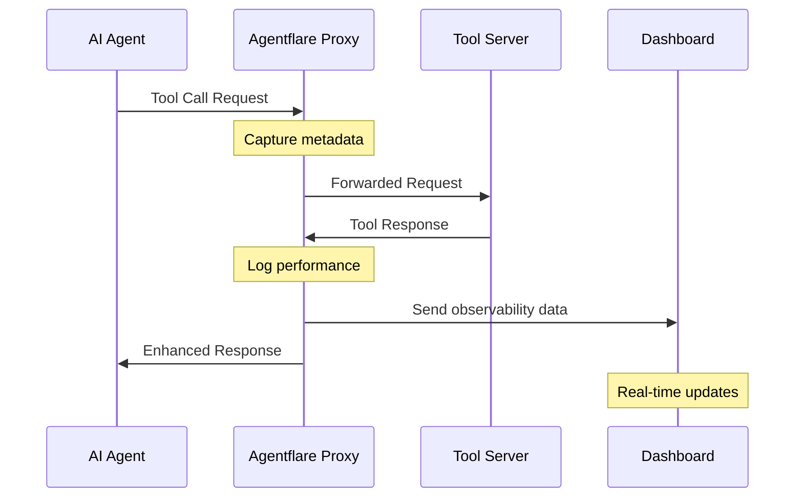

## Architecture Overview



## What is Agentflare?

Agentflare provides **protocol-level observability** for AI agent tool servers. Track every decision, measure tool selection performance, and validate compliance in real-time.

Build transparent, reliable AI agents your team can trust.

<CardGroup cols={2}>
  <Card title="Tool Reasoning" icon="brain" href="/content/thought-tracing">
    See exactly why your AI agents select specific tools
  </Card>
  <Card
    title="Agent Reasoning"
    icon="lightbulb"
    href="/content/thought-tracing"
  >
    Trace step-by-step agent decision-making processes
  </Card>
  <Card title="Performance Analytics" icon="chart-line" href="/content/performance-analytics">
    Monitor latency, throughput, and resource usage in real-time
  </Card>
  <Card title="Cost Tracking" icon="dollar-sign" href="/content/cost-tracking">
    Track API costs per tool call, session, and model
  </Card>
  <Card title="Schema Studio" icon="code">
    Fine-tune decision pathways without redeploying code
  </Card>
  <Card title="Tool Call Feed" icon="terminal" href="/content/tool-calls">
    Live feed of all tool invocations with full context
  </Card>
</CardGroup>

## Why Agentflare?

### The Challenge

| Without Observability | With Agentflare |
|-------------------|----------------|
| 🚫 **Opaque Decisions** - Why did the agent choose this tool? | ✅ **Complete Reasoning** - See exactly why each decision was made |
| 🚫 **Unknown Costs** - How much is this costing me? | ✅ **Real-time Cost Tracking** - Track costs per tool, session, and model |
| 🚫 **Performance Blindness** - Where are the bottlenecks? | ✅ **Performance Analytics** - Identify bottlenecks and optimize |
| 🚫 **Debugging Nightmare** - Agent failed, but why? | ✅ **Rich Error Context** - Detailed error information and context |
| 🚫 **Complex Setup** - Manual instrumentation required | ✅ **Simple Proxy** - Add tool server, get proxy URL, done |

### The Solution

Agentflare provides complete visibility into your agent's decision-making process:

<Steps>
  <Step title="Add Tool Server">
    Add your MCP tool server to Agentflare via the dashboard
  </Step>
  <Step title="Get Proxy URL">
    Receive a unique proxy URL for instant observability
  </Step>
  <Step title="Configure Agent">
    Point your AI agent to use the Agentflare proxy
  </Step>
  <Step title="Observe Everything">
    See tool calls, reasoning, performance, and costs in real-time
  </Step>
</Steps>

## Core Features

<AccordionGroup>
  <Accordion title="Multi-Tenant Proxy" icon="server">
    Hosted proxy service providing instant observability for any tool server:
    - Custom domains (mcp.company.com)
    - Zero code changes required
    - Automatic reasoning capture
    - Cost estimation and tracking
  </Accordion>

  <Accordion title="Real-time Dashboard" icon="desktop">
    Comprehensive visualization of agent behavior:
    - Live feed of tool calls with reasoning
    - Performance metrics and bottleneck identification
    - Cost analytics per tool/session/model
    - Usage analytics for tool servers
  </Accordion>

  <Accordion title="Schema Studio" icon="code">
    Fine-tune tool schemas and decision pathways:
    - Adjust tool descriptions in real-time
    - Test schema changes instantly
    - Optimize tool selection without redeployment
    - A/B test different configurations
  </Accordion>

  <Accordion title="Memory Replay" icon="history">
    Complete reconstruction of agent decision processes:
    - Step-by-step replay of tool sequences
    - Reasoning visibility at each decision point
    - Cost breakdown per step
    - Debugging and analysis tools
  </Accordion>

  <Accordion title="OTEL Export" icon="chart-line">
    Send data to your existing observability stack:
    - Jaeger, Datadog, New Relic, Grafana
    - Standard OpenTelemetry format
    - Custom exporters supported
    - No vendor lock-in
  </Accordion>
</AccordionGroup>

## How It Works

### 1. Proxy Architecture

Agentflare sits between your AI agents and tool servers:



### 2. Zero Configuration

No SDK to install, no code to change:

<Tabs>
  <Tab title="Before Agentflare">
    ```typescript
    import { Client } from "@modelcontextprotocol/sdk/client/index.js";
    import { HTTPTransport } from "@modelcontextprotocol/sdk/client/http.js";

    // Direct connection - no observability
    const client = new Client({
      transport: new HTTPTransport({
        baseUrl: "https://your-tool-server.com/mcp"
      })
    });
    ```
  </Tab>
  <Tab title="With Agentflare">
    ```typescript
    import { Client } from "@modelcontextprotocol/sdk/client/index.js";
    import { HTTPTransport } from "@modelcontextprotocol/sdk/client/http.js";

    // Route through Agentflare - instant observability
    const client = new Client({
      transport: new HTTPTransport({
        baseUrl: "https://proxy.agentflare.com/workspace/server-slug",
        headers: {
          "Authorization": `Bearer ${process.env.AGENTFLARE_API_KEY}`
        }
      })
    });
    // That's it! Full observability with one URL change
    ```
  </Tab>
</Tabs>

### 3. Rich Observability

Automatically captures:
- **Tool calls** - Every tool invocation with arguments and results
- **Tool reasoning** - Why the agent selected each tool
- **Agent reasoning** - Step-by-step decision process
- **Performance** - Latency, throughput, error rates
- **Cost** - API costs per call, session, and model
- **Confidence** - Decision confidence scores and alternatives

## Use Cases

### Development & Debugging
- **Debug agent behavior** - Understand why agents make specific choices
- **Optimize tool selection** - Identify and improve poor tool choices
- **Test prompt variations** - A/B test different prompts and schemas
- **Validate reasoning** - Ensure agents think as expected

### Production Monitoring
- **Real-time alerting** - Get notified of issues immediately
- **Performance tracking** - Monitor SLAs and response times
- **Cost control** - Stay within budget and optimize spending
- **Compliance** - Audit agent decisions for regulatory requirements

### Tool Server Optimization
- **Usage analytics** - Understand how tools are being used
- **Schema refinement** - Optimize tool descriptions with Schema Studio
- **Performance tuning** - Identify slow or failing tools
- **Cost analysis** - Find expensive tools and optimize

## Getting Started

<CardGroup cols={2}>
  <Card title="Quickstart Guide" icon="rocket" href="/content/quickstart">
    Get up and running in 5 minutes
  </Card>
  <Card title="Installation" icon="download" href="/content/installation">
    Complete setup instructions
  </Card>
  <Card title="Features Overview" icon="telescope" href="/content/features-overview">
    Explore all features in depth
  </Card>
  <Card title="API Reference" icon="book" href="/api-reference/introduction">
    Explore our comprehensive API
  </Card>
</CardGroup>

## Supported Protocols

Agentflare works with multiple protocols:

<Tabs>
  <Tab title="MCP (Model Context Protocol)">
    Full support for MCP tool servers:
    - HTTP/HTTPS transport
    - WebSocket transport
    - Stdio transport (hosted)
    - All MCP methods and capabilities
  </Tab>
  <Tab title="Custom Protocols">
    Support for custom agent protocols:
    - REST APIs
    - gRPC
    - GraphQL
    - WebSockets
    Contact us for custom protocol support
  </Tab>
</Tabs>

## Join the Community

Have questions? Want to contribute? Join our growing community:

<CardGroup cols={3}>
  <Card
    title="GitHub"
    icon="github"
    href="https://github.com/agentflare-ai"
  >
    Star us on GitHub
  </Card>
  <Card title="Discord" icon="discord" href="https://discord.gg/agentflare">
    Join our Discord server
  </Card>
  <Card title="X" icon="x-twitter" href="https://x.com/AgentflareAI">
    Follow us on X
  </Card>
</CardGroup>

---

<Note>
  Agentflare is designed to be minimally invasive with < 1ms latency overhead and asynchronous data collection. Your agents run at full speed while you get complete observability.
</Note>
