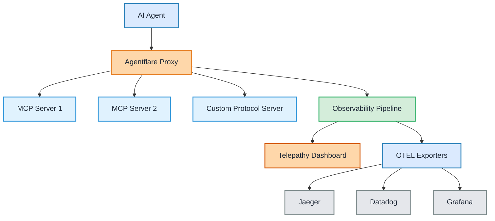

## Architecture Overview

## What is Telepathy?

Telepathy is the first comprehensive observability service for MCP-based AI agents that captures decision reasoning, performance metrics, and cost attribution. It's designed to give developers and MCP server owners complete visibility into their agent's thought processes.

<CardGroup cols={2}>
  <Card title="Thought Tracing" icon="brain" href="/content/thought-tracing">
    See exactly why your AI agents make the decisions they do
  </Card>
  <Card
    title="Performance Analytics"
    icon="chart-line"
    href="/content/performance-analytics"
  >
    Monitor latency, throughput, and resource usage in real-time
  </Card>
  <Card title="Cost Tracking" icon="dollar-sign" href="/content/cost-tracking">
    Track API costs per tool call, session, and model
  </Card>
  <Card title="Tool Call Feed" icon="terminal" href="/content/tool-calls">
    Live feed of all tool invocations with full context
  </Card>
</CardGroup>

## Why Telepathy?

### The Problem vs. Solution

| Without Telepathy | With Telepathy |
|-------------------|----------------|
| 🚫 **Opaque Decisions** - Why did the agent choose this tool? | ✅ **Complete Reasoning** - See exactly why each decision was made |
| 🚫 **Unknown Costs** - How much is this costing me? | ✅ **Real-time Cost Tracking** - Track costs per tool, session, and model |
| 🚫 **Performance Blindness** - Where are the bottlenecks? | ✅ **Performance Analytics** - Identify bottlenecks and optimize |
| 🚫 **Debugging Nightmare** - Agent failed, but why? | ✅ **Rich Error Context** - Detailed error information and context |
| 🚫 **Manual Instrumentation** - Complex observability setup | ✅ **One-Line Integration** - Change one import line, get instant observability |

### The Solution

Telepathy provides complete visibility into your agent's decision-making process:

<Steps>
  <Step title="Drop-in Integration">
    Change one import line in your code - that's it
  </Step>
  <Step title="Automatic Instrumentation">
    Every tool call is captured with reasoning, timing, and cost
  </Step>
  <Step title="Real-time Visualization">
    See your agent's thoughts in real-time through our dashboard
  </Step>
  <Step title="Export Anywhere">
    Send data to your existing observability stack via OTEL
  </Step>
</Steps>

## Core Features

<AccordionGroup>
  <Accordion title="Multi-Tenant Proxy" icon="server">
    Hosted proxy service providing instant observability for any MCP deployment:
    - Custom domains (mcp.company.com)
    - Zero deployment setup
    - Model identification via self-identification
    - Cost estimation and tracking
  </Accordion>

  <Accordion title="Enhanced MCP SDKs" icon="code">
    Drop-in replacement SDKs with OTEL instrumentation:
    - Automatic span generation with reasoning
    - Tool call attribution and confidence scores
    - Cost tracking per call
    - Performance metrics
  </Accordion>

  <Accordion title="Telepathy Dashboard" icon="desktop">
    Real-time mind-reading visualization:
    - Live feed of tool calls with reasoning
    - Performance metrics and bottleneck identification
    - Cost analytics per tool/session/model
    - Usage analytics for MCP servers
  </Accordion>

  <Accordion title="Memory Replay" icon="history">
    Complete reconstruction of agent decision processes:
    - Step-by-step replay of tool sequences
    - Reasoning visibility at each decision point
    - Cost breakdown per step
  </Accordion>
</AccordionGroup>

## Getting Started

<CardGroup cols={2}>
  <Card title="Quickstart Guide" icon="rocket" href="/content/quickstart">
    Get up and running in 5 minutes
  </Card>
  <Card title="API Reference" icon="book" href="/api-reference/introduction">
    Explore our comprehensive API
  </Card>
</CardGroup>

## Join the Community

Have questions? Want to contribute? Join our growing community:

<CardGroup cols={3}>
  <Card
    title="GitHub"
    icon="github"
    href="https://github.com/agentflare-ai/agentflare"
  >
    Star us on GitHub
  </Card>
  <Card title="Discord" icon="discord" href="https://discord.gg/agentflare">
    Join our Discord server
  </Card>
  <Card title="Twitter" icon="twitter" href="https://twitter.com/agentflare">
    Follow us on Twitter
  </Card>
</CardGroup>
