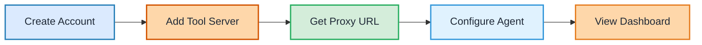

## 5-Minute Setup Overview



## Prerequisites

Before you begin, make sure you have:

- An MCP-compatible tool server (or use one of our examples)
- An AI agent or client that can connect to MCP servers
- An Agentflare account ([sign up here](https://app.agentflare.com/login))

## Quick Setup

### Step 1: Create Your Account

1. Go to [app.agentflare.com](https://app.agentflare.com/login)
2. Sign up for a free account
3. Verify your email address

### Step 2: Add Your Tool Server

Navigate to **Dashboard → Tool Servers → Add Server**

You can add a tool server in several ways:

<Tabs>
  <Tab title="HTTP/HTTPS Server">
    ```json
    {
      "name": "my-search-server",
      "type": "http",
      "endpoint": "https://your-server.com/mcp",
      "authentication": {
        "type": "bearer",
        "token": "your-server-token"
      }
    }
    ```
  </Tab>
  <Tab title="WebSocket Server">
    ```json
    {
      "name": "my-realtime-server",
      "type": "websocket",
      "endpoint": "wss://your-server.com/mcp",
      "authentication": {
        "type": "bearer",
        "token": "your-server-token"
      }
    }
    ```
  </Tab>
  <Tab title="Stdio Server">
    ```json
    {
      "name": "my-local-server",
      "type": "stdio",
      "command": "/path/to/mcp-server",
      "args": ["--config", "config.json"]
    }
    ```
  </Tab>
</Tabs>

### Step 3: Get Your Proxy URL

After adding your tool server, Agentflare will generate a unique proxy URL:

```
https://proxy.agentflare.com/<your-workspace>/<your-server-slug>
```

Copy this URL - you'll use it to configure your AI agent.

### Step 4: Configure Your Agent

Update your AI agent or MCP client to use the Agentflare proxy URL:

<Tabs>
  <Tab title="Standard MCP Client">
    <CodeGroup>
    ```typescript TypeScript
    import { Client } from "@modelcontextprotocol/sdk/client/index.js";
    import { HTTPTransport } from "@modelcontextprotocol/sdk/client/http.js";

    const client = new Client({
      transport: new HTTPTransport({
        baseUrl: "https://proxy.agentflare.com/<workspace>/<server-slug>",
        headers: {
          "Authorization": `Bearer ${process.env.AGENTFLARE_API_KEY}`
        }
      })
    });

    await client.connect();

    // Make tool calls as usual - they'll be automatically tracked
    const result = await client.callTool({
      name: "search",
      arguments: { query: "documentation" }
    });
    ```

    ```python Python
    from mcp import Client
    from mcp.transport import HTTPTransport

    client = Client(
        transport=HTTPTransport(
            base_url="https://proxy.agentflare.com/<workspace>/<server-slug>",
            headers={
                "Authorization": f"Bearer {os.getenv('AGENTFLARE_API_KEY')}"
            }
        )
    )

    await client.connect()

    # Make tool calls - automatically tracked
    result = await client.call_tool(
        name="search",
        arguments={"query": "documentation"}
    )
    ```
    </CodeGroup>
  </Tab>

  <Tab title="Environment Variables">
    ```bash
    # Set environment variables
    export MCP_SERVER_URL="https://proxy.agentflare.com/<workspace>/<server-slug>"
    export AGENTFLARE_API_KEY="your_api_key_here"

    # Your existing agent code will automatically use these
    ```
  </Tab>

  <Tab title="Configuration File">
    ```json config.json
    {
      "mcpServers": {
        "your-server": {
          "url": "https://proxy.agentflare.com/<workspace>/<server-slug>",
          "headers": {
            "Authorization": "Bearer YOUR_API_KEY"
          }
        }
      }
    }
    ```
  </Tab>
</Tabs>

### Step 5: View Your Data

Once configured, navigate to your [Agentflare dashboard](https://app.agentflare.com) to see:

<CardGroup cols={2}>
  <Card title="Live Tool Calls" icon="terminal">
    Real-time feed of all tool invocations
  </Card>
  <Card title="Tool Reasoning" icon="brain">
    See why agents selected specific tools
  </Card>
  <Card title="Performance Metrics" icon="chart-line">
    Latency, throughput, and error rates
  </Card>
  <Card title="Cost Tracking" icon="dollar-sign">
    Track API costs per tool and session
  </Card>
</CardGroup>

## What Gets Tracked?

Agentflare automatically captures:

- **Tool calls** - Every tool invocation with arguments and results
- **Reasoning** - Why the agent selected each tool (when provided)
- **Performance** - Latency, throughput, error rates
- **Cost** - API costs per call, session, and model
- **Metadata** - Confidence scores, alternatives considered, context

## Enhanced Observability (Optional)

For even richer insights, add reasoning metadata to your tool calls:

<CodeGroup>

```typescript TypeScript - Enhanced
const result = await client.callTool({
  name: "search",
  arguments: { query: "customer support tickets" },
  // Add reasoning context for better observability
  metadata: {
    reasoning: "User asked about recent support issues, searching database",
    confidence: 0.95,
    alternatives: ["search_knowledge_base", "ask_human_agent"],
    context: "Customer service manager weekly report"
  }
});
```

```python Python - Enhanced
result = await client.call_tool(
    name="search",
    arguments={"query": "customer support tickets"},
    # Add reasoning for richer insights
    metadata={
        "reasoning": "User asked about recent support issues, searching database",
        "confidence": 0.95,
        "alternatives": ["search_knowledge_base", "ask_human_agent"]
    }
)
```

</CodeGroup>

<Note>
  Reasoning metadata is optional but highly recommended. It enables Agentflare's advanced features like reasoning analysis, decision trees, and pattern detection.
</Note>

## Example: Complete Setup

Here's a complete example showing the full integration:

```typescript
import { Client } from "@modelcontextprotocol/sdk/client/index.js";
import { HTTPTransport } from "@modelcontextprotocol/sdk/client/http.js";

// Configure client with Agentflare proxy
const client = new Client({
  transport: new HTTPTransport({
    baseUrl: "https://proxy.agentflare.com/my-workspace/search-server",
    headers: {
      "Authorization": `Bearer ${process.env.AGENTFLARE_API_KEY}`
    }
  })
});

// Connect to server
await client.connect();

// List available tools (automatically tracked)
const tools = await client.listTools();
console.log("Available tools:", tools);

// Call a tool with reasoning (tracked in dashboard)
const result = await client.callTool({
  name: "search_database",
  arguments: {
    query: "recent customer tickets",
    limit: 10
  },
  metadata: {
    reasoning: "Generating weekly customer support report",
    confidence: 0.92,
    alternatives: ["manual_query", "cached_report"]
  }
});

console.log("Result:", result);
// Check your Agentflare dashboard to see this call tracked in real-time!
```

## Next Steps

<CardGroup cols={2}>
  <Card title="Features Overview" icon="telescope" href="/content/features-overview">
    Explore all observability features
  </Card>
  <Card title="MCP Proxy Setup" icon="server" href="/content/mcp-proxy">
    Advanced proxy configuration
  </Card>
  <Card title="Tool Reasoning" icon="brain" href="/content/thought-tracing">
    Learn about reasoning capture
  </Card>
  <Card title="Best Practices" icon="lightbulb" href="/content/best-practices">
    Optimization techniques
  </Card>
</CardGroup>

## Troubleshooting

<AccordionGroup>
  <Accordion title="Connection Issues">
    If you're having trouble connecting:
    1. Verify your proxy URL is correct
    2. Check your API key is valid and not expired
    3. Ensure your network allows outbound HTTPS
    4. Check the Agentflare status page
  </Accordion>
  <Accordion title="Missing Data">
    If tool calls aren't appearing in the dashboard:
    1. Verify the proxy URL is being used
    2. Check API key is included in headers
    3. Look for errors in your application logs
    4. Ensure your tool server is responding correctly
  </Accordion>
  <Accordion title="Performance Impact">
    Agentflare is designed for minimal overhead:
    - Asynchronous data collection
    - Batched exports
    - < 1ms latency impact
    - No blocking operations
  </Accordion>
</AccordionGroup>

Need help? Contact support at support@agentflare.com or visit our [Discord](https://discord.gg/agentflare).
