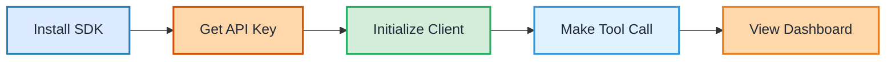

## 5-Minute Setup Overview



## Prerequisites

Before you begin, make sure you have:

- An MCP-compatible AI agent
- Node.js 18+ or Python 3.8+
- An Agentflare account ([sign up here](/early-access))

## Installation

<CodeGroup>

```bash npm
npm install @agentflare/telepathy-sdk
```

```bash yarn
yarn add @agentflare/telepathy-sdk
```

```bash pnpm
pnpm add @agentflare/telepathy-sdk
```

```bash pip
pip install agentflare-telepathy
```

</CodeGroup>

## Quick Setup

### Step 1: Get Your API Key

1. Log in to your [Agentflare dashboard](/dashboard)
2. Navigate to Settings → API Keys
3. Create a new API key with the name "Development"
4. Copy the key - you'll need it in the next step

<Warning>
  Never commit your API key to version control. Use environment variables
  instead.
</Warning>

### Step 2: Initialize Telepathy

Transform your existing MCP client with just one line change:

<Tabs>
  <Tab title="Before & After">
    <CodeGroup>
    ```typescript Before (Standard MCP)
    import { Client } from "@modelcontextprotocol/sdk/client/index.js";
    import { StdioServerTransport } from "@modelcontextprotocol/sdk/client/stdio.js";

    // Standard MCP client - no observability
    const client = new Client({
      transport: new StdioServerTransport({
        command: "mcp-server",
        args: ["--config", "config.json"]
      })
    });

    await client.connect();
    
    // Basic tool call
    const result = await client.callTool({
      name: "search",
      arguments: { query: "Agentflare documentation" }
    });
    ```

    ```typescript After (With Telepathy)
    import { TelepathyClient } from "@agentflare/telepathy-sdk";

    // Telepathy client - instant observability
    const client = new TelepathyClient({
      apiKey: process.env.API_JWT_SECRET,
      projectId: process.env.AGENTFLARE_PROJECT_ID,
      servers: [{
        name: "search-server",
        transport: "stdio",
        command: "mcp-server",
        args: ["--config", "config.json"]
      }]
    });

    // Enhanced tool call with reasoning
    const result = await client.callTool({
      name: "search",
      arguments: { query: "Agentflare documentation" },
      metadata: {
        reasoning: "User requested documentation search",
        confidence: 0.95
      }
    });
    ```
    </CodeGroup>
  </Tab>
  
  <Tab title="Python">
    <CodeGroup>
    ```python Before (Standard MCP)
    from mcp import Client
    from mcp.transport import StdioTransport

    # Standard MCP client
    client = Client(
        transport=StdioTransport(
            command="mcp-server",
            args=["--config", "config.json"]
        )
    )

    await client.connect()
    
    result = await client.call_tool(
        name="search",
        arguments={"query": "Agentflare documentation"}
    )
    ```

    ```python After (With Telepathy)
    from agentflare_telepathy import TelepathyClient

    # Telepathy client with observability
    client = TelepathyClient(
        api_key=os.getenv("API_JWT_SECRET"),
        project_id=os.getenv("AGENTFLARE_PROJECT_ID"),
        servers=[{
            "name": "search-server",
            "transport": "stdio",
            "command": "mcp-server",
            "args": ["--config", "config.json"]
        }]
    )

    # Enhanced tool call
    result = await client.call_tool(
        name="search",
        arguments={"query": "Agentflare documentation"},
        metadata={
            "reasoning": "User requested documentation search",
            "confidence": 0.95
        }
    )
    ```
    </CodeGroup>
  </Tab>
</Tabs>

### Step 3: Add Reasoning Context

To get the most out of Telepathy's thought tracing, add reasoning context to your tool calls:

<CodeGroup>

```typescript TypeScript
const result = await client.callTool({
  name: "search",
  arguments: { query: "Agentflare documentation" },
  metadata: {
    reasoning:
      "User asked about Agentflare features, searching documentation for detailed information",
    confidence: 0.95,
    alternatives: ["browse website", "ask support"],
  },
});
```

```python Python
result = await client.call_tool(
    name="search",
    arguments={"query": "Agentflare documentation"},
    metadata={
        "reasoning": "User asked about Agentflare features, searching documentation for detailed information",
        "confidence": 0.95,
        "alternatives": ["browse website", "ask support"]
    }
)
```

</CodeGroup>

## View Your Data

Once you've made your first tool call, you can view the data in multiple ways:

### 1. Telepathy Dashboard

Navigate to your [Telepathy dashboard](/dashboard) to see:

- Real-time tool call feed
- Reasoning breakdown for each call
- Performance metrics
- Cost tracking

### 2. Export to Your Observability Stack

Telepathy supports OTEL export to popular platforms:

<Tabs>
  <Tab title="Jaeger">
    ```typescript
    const client = new TelepathyClient({
      apiKey: process.env.API_JWT_SECRET,
      exporters: {
        jaeger: {
          endpoint: 'http://localhost:14268/api/traces'
        }
      }
    });
    ```
  </Tab>
  <Tab title="Datadog">
    ```typescript
    const client = new TelepathyClient({
      apiKey: process.env.API_JWT_SECRET,
      exporters: {
        datadog: {
          apiKey: process.env.DD_API_KEY,
          site: 'datadoghq.com'
        }
      }
    });
    ```
  </Tab>
  <Tab title="New Relic">
    ```typescript
    const client = new TelepathyClient({
      apiKey: process.env.API_JWT_SECRET,
      exporters: {
        newrelic: {
          apiKey: process.env.NEW_RELIC_API_KEY
        }
      }
    });
    ```
  </Tab>
</Tabs>

## Next Steps

<CardGroup cols={2}>
  <Card
    title="Telepathy Overview"
    icon="telescope"
    href="/content/telepathy-overview"
  >
    Deep dive into Telepathy's features
  </Card>
  <Card title="MCP Proxy Setup" icon="server" href="/content/mcp-proxy">
    Set up the multi-tenant proxy
  </Card>
  <Card title="SDK Reference" icon="code" href="/sdk/typescript">
    Explore the full SDK capabilities
  </Card>
  <Card title="Best Practices" icon="lightbulb" href="/content/best-practices">
    Learn optimization techniques
  </Card>
</CardGroup>

## Troubleshooting

<AccordionGroup>
  <Accordion title="Connection Issues">
    If you're having trouble connecting:
    1. Verify your API key is correct
    2. Check your network allows outbound HTTPS
    3. Ensure your project ID matches your dashboard
  </Accordion>
  <Accordion title="Missing Data">
    If tool calls aren't appearing:
    1. Check the client is initialized before use
    2. Verify environment variables are loaded
    3. Look for errors in your console
  </Accordion>
  <Accordion title="Performance Impact">
    Telepathy is designed for minimal overhead:
    - Asynchronous data collection
    - Batched exports
    - < 1ms latency impact
  </Accordion>
</AccordionGroup>

Need help? Contact support at support@agentflare.com or visit our [Discord](https://discord.gg/agentflare).
